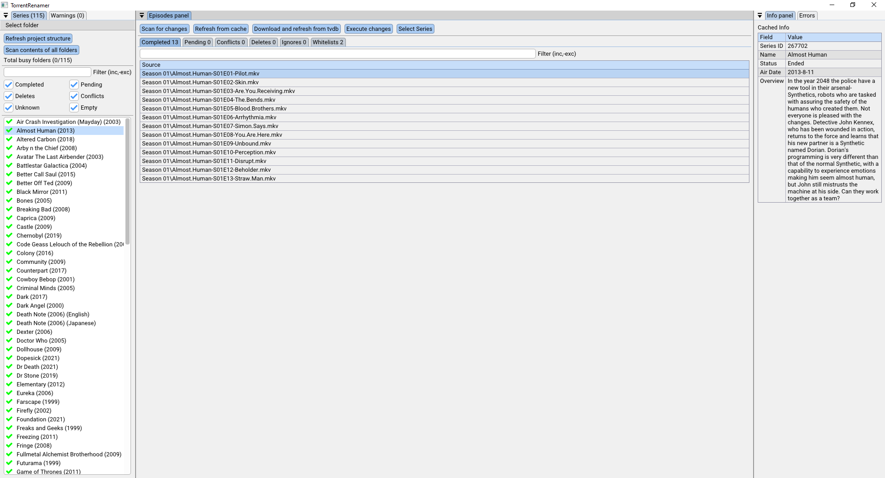
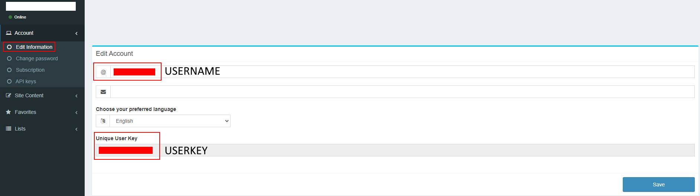
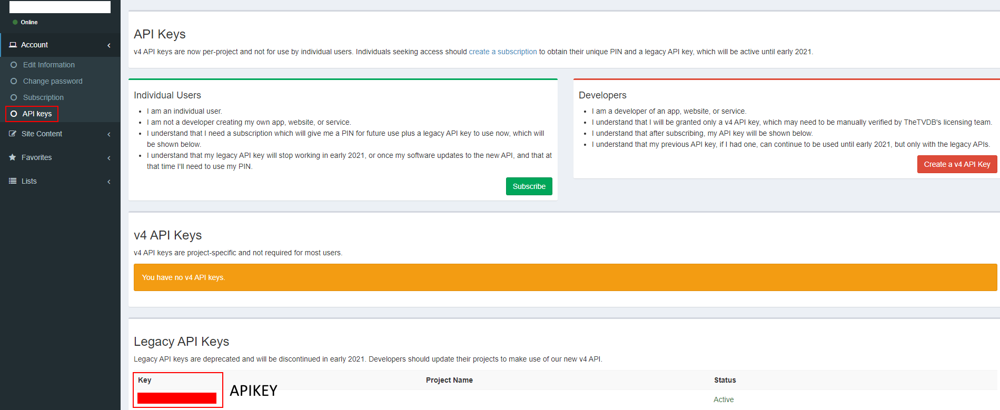

# Introduction
[](https://github.com/FiendChain/TorrentRenamerCpp/actions/workflows/x86-windows.yml)
[](https://github.com/FiendChain/TorrentRenamerCpp/actions/workflows/x86-ubuntu.yml)

A torrent renaming tool built in C++
- Uses TVDB database for renaming files with correct names
- Uses regex search for finding candidates for renaming
- Deletes blacklisted extensions

# Preview


# Credentials
For both the gui app and cli scripts, you need to supply your TVDB api credentials. 
See "res/example-credentials.json" for the json template.
The default path that is read is "credentials.json".

## Getting credentials from dashboard
You can check out the [tvdb dashboard](https://thetvdb.com/dashboard) for your api information. This is required for performing api requests.




# Building
1. Setup development environment for Windows or Ubuntu.
2. ```CC=clang CXX=clang++ ./scripts/cmake_configure.sh```.
3. ```ninja -C build```
4. ```./build/main /your_directory```